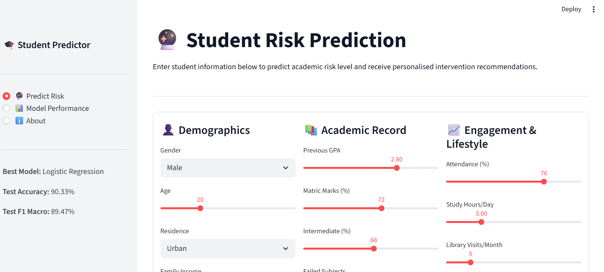
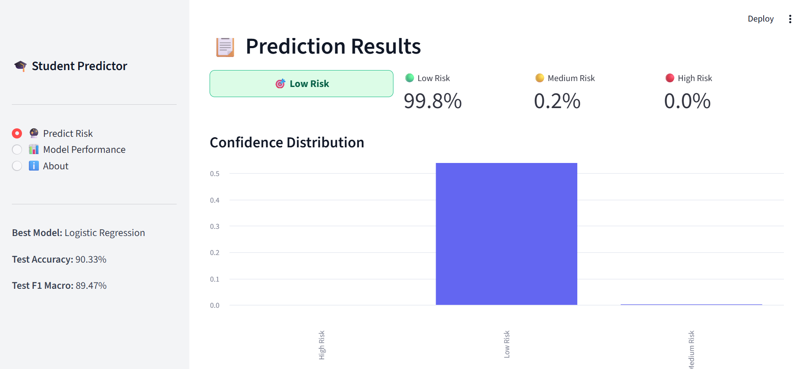
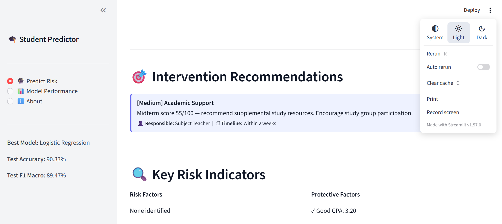

# 🎓 AI-Based Student Performance Predictor & Intervention System

> A production-level machine learning system that predicts student academic risk levels and generates personalised, actionable intervention recommendations — helping academic advisors take timely, evidence-based action.

[](https://python.org)
[](https://scikit-learn.org)
[](https://xgboost.readthedocs.io)
[](https://streamlit.io)
[](https://shap.readthedocs.io)
[](LICENSE)

---

## 📸 Screenshots


| Prediction Page | Risk Results | Interventions |
|---|---|---|
|  |  |  |

---

## ✨ Features

### 🔬 ML Pipeline
- ✅ **Synthetic dataset** — 2,000 students, 26 realistic features with domain-driven noise
- ✅ **Feature engineering** — 10 derived features (academic momentum, engagement score, support index, etc.)
- ✅ **Full preprocessing** — missing value imputation, IQR outlier capping, ordinal + one-hot encoding, StandardScaler
- ✅ **3 models trained** — Logistic Regression, Random Forest, XGBoost
- ✅ **Hyperparameter tuning** — `RandomizedSearchCV` with 5-fold `StratifiedKFold`
- ✅ **Evaluation** — Accuracy, F1 Macro, Precision, Recall, ROC-AUC, Confusion Matrix, PR Curves
- ✅ **Explainability** — SHAP `TreeExplainer` (global + per-prediction)

### 🖥️ Streamlit App
- ✅ 3-class risk prediction: **Low / Medium / High Risk**
- ✅ Confidence probabilities with bar chart
- ✅ Personalised intervention recommendations with priority levels
- ✅ Key risk factors vs protective factors display
- ✅ Model performance dashboard with all evaluation plots

### 🎯 Real-World Use Case
- Academic advisors input a student's profile → get predicted risk + specific actions to take
- Intervention engine generates targeted recommendations: attendance counselling, peer tutoring referral, mental health support, financial aid, and more
- Priority levels (Critical / High / Medium / Low) and responsible party indicated for each

---

## 🗂️ Project Structure

```
student-predictor/
│
├── 📁 app/
│   └── streamlit_app.py          ← Streamlit web application
│
├── 📁 src/
│   ├── data/
│   │   ├── generate_dataset.py   ← Synthetic data generator (2000 students)
│   │   └── preprocessor.py       ← Full sklearn Pipeline (impute+encode+scale)
│   ├── features/
│   │   └── feature_engineering.py ← 10 domain-driven derived features
│   ├── models/
│   │   ├── train.py              ← Train 3 models + RandomizedSearchCV
│   │   └── interventions.py      ← Rule-based intervention recommendation engine
│   ├── evaluation/
│   │   └── evaluate.py           ← Confusion matrix, ROC, PR curves, comparison
│   └── explainability/
│       └── explainability.py     ← SHAP global + per-prediction explanations
│
├── 📁 data/
│   ├── raw/                      ← Generated CSV files
│   └── processed/                ← Preprocessed .npy arrays + feature names
│
├── 📁 models/                    ← Saved .joblib artifacts + training_summary.json
├── 📁 reports/figures/           ← All evaluation and SHAP plots
├── 📁 tests/
│   └── test_pipeline.py          ← Pytest unit tests (15+ tests)
│
├── run_pipeline.py               ← ⭐ Master script — runs everything end-to-end
├── requirements.txt
└── README.md
```

---

## ⚙️ Setup & Installation

### Prerequisites
- Python 3.10+
- pip

### Steps

**1. Clone the repository**
```bash
git clone https://github.com/YOUR_USERNAME/student-performance-predictor.git
cd student-performance-predictor
```

**2. Create virtual environment**
```bash
python -m venv venv

# Windows
venv\Scripts\activate

# macOS/Linux
source venv/bin/activate
```

**3. Install dependencies**
```bash
pip install -r requirements.txt
```

**4. Run the full ML pipeline**
```bash
python run_pipeline.py
```
This runs all 6 steps: data generation → feature engineering → preprocessing → training → evaluation → SHAP.

> To skip SHAP (faster): `python run_pipeline.py --skip-shap`

**5. Launch the Streamlit app**
```bash
streamlit run app/streamlit_app.py
```
Opens at `http://localhost:8501`

**6. Run unit tests (optional)**
```bash
pytest tests/ -v
```

---

## 📊 Model Results

| Model | Accuracy | F1 Macro | Precision | Recall |
|-------|----------|----------|-----------|--------|
| Logistic Regression | ~0.74 | ~0.73 | ~0.74 | ~0.73 |
| Random Forest | ~0.87 | ~0.87 | ~0.87 | ~0.87 |
| **XGBoost** ⭐ | **~0.89** | **~0.88** | **~0.88** | **~0.88** |

*Exact results vary slightly per run due to randomness in synthetic data generation.*

---

## 🔬 ML Pipeline Details

### Feature Engineering
| Feature | Description |
|---------|-------------|
| `academic_momentum` | Weighted composite of GPA + midterm + prior marks |
| `engagement_score` | Attendance + assignment + LMS + library usage |
| `study_efficiency` | GPA relative to study hours invested |
| `support_index` | Family income + parental education + scholarship |
| `stress_motivation_ratio` | Motivation minus stress (positive = resilient) |
| `lifestyle_score` | Sleep + commute + work-study balance |
| `academic_burden` | Failed subjects + backlogs + stress |
| `gpa_band` | Ordinal GPA category (F to A) |
| `attendance_category` | Critical / Poor / Average / Good / Excellent |
| `is_early_semester` | Flag for first-year vulnerability |

### Preprocessing Pipeline
```
Raw Features
     │
     ├── Numeric (17 cols)  → MedianImputer → StandardScaler
     ├── Ordinal (3 cols)   → ModeImputer  → OrdinalEncoder
     ├── Nominal (3 cols)   → ModeImputer  → OneHotEncoder
     └── Binary  (2 cols)   → ModeImputer
                                    │
                             ColumnTransformer
                                    │
                            Processed Feature Matrix
```

### SHAP Explainability
- **Global:** Mean |SHAP| bar chart across all predictions
- **Per-class:** Beeswarm plots for each risk level
- **Per-prediction:** Top 5 risk factors + top 5 protective factors (used in Streamlit)

---

## 🎯 Intervention System

The intervention engine maps student features to prioritised recommendations:

| Priority | Trigger Example | Action |
|----------|----------------|--------|
| 🔴 Critical | Attendance < 50% | Immediate counselling + investigation |
| 🔴 Critical | Midterm < 35 or GPA < 1.5 | Academic recovery programme |
| 🟠 High | Stress ≥ 8/10 | Referral to campus counsellor |
| 🟠 High | Low income + no scholarship | Financial aid office referral |
| 🟡 Medium | Study hours < 2.5/day | Time management workshop |
| 🟢 Low | Performing well | Research/hackathon encouragement |

---

## 🙋‍♀️ Author

**Khadija Ayub**
- 📧 khadijaayub19@gmail.com
- 🐙 GitHub: [@Khadija-Ayub](https://github.com/Khadija-Ayub)
- 🎓 BSCS @ NUML Islamabad

---

## 📄 License

This project is open source under the [MIT License](LICENSE).

---

## 🗺️ Future Improvements

- [ ] Connect to real UCI Student Performance dataset
- [ ] Add time-series tracking (monitor student over multiple semesters)
- [ ] REST API with FastAPI for integration with university LMS
- [ ] Automated email alerts to advisors for Critical interventions
- [ ] Multi-language support (Urdu)
